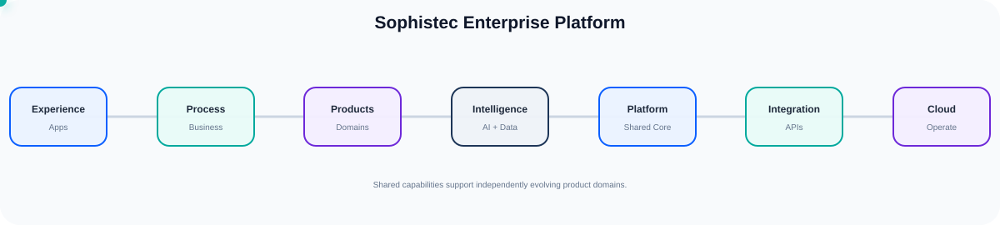
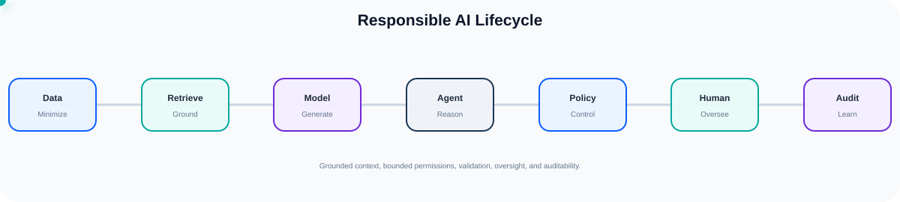
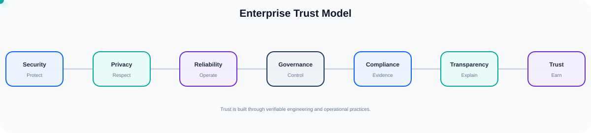

# SOPHISTEC GLOBAL

### Estrategia · Software · SaaS · IA · Innovación

  <strong>Choose your language</strong> 
  
  
  
  
  
  
  
  

---

## Acerca de Sophistec

**Sophistec Global** es un ecosistema multidisciplinario que conecta estrategia empresarial, desarrollo de software, productos SaaS, IA, tecnología creativa, educación y comunidades.

Creamos soluciones digitales de principio a fin: **estrategia → arquitectura → producto → integración → IA → despliegue → operaciones → mejora continua**.

### Capacidades principales

- Ingeniería de productos full-stack
- SaaS y plataformas multiinquilino
- Backend, API y microservicios
- Agentes de IA, RAG, MCP y automatización
- Datos, analítica y aprendizaje automático
- Integración empresarial
- Identidad, organización, facturación y permisos
- DevOps, observabilidad, fiabilidad y seguridad
- Salud, comercio, soporte, educación y operaciones empresariales

## Plataforma e ingeniería

La dirección de la plataforma Sophistec incluye capacidades compartidas de **Identity, Organization, Billing, API, Integration, Data, Intelligence, Automation, Observability, Security y Developer Platform**.

## IA responsable

Los sistemas de IA de Sophistec priorizan el contexto fiable, los límites de permisos, la validación de resultados, la auditabilidad y la supervisión humana cuando sea necesaria.

## Confianza y preparación empresarial

Distinguimos claramente entre capacidad de ingeniería, preparación para el cumplimiento y certificaciones formales. Solo declaramos una certificación cuando realmente se ha obtenido.

## Documentación técnica completa

El **README en inglés** es la documentación técnica oficial y más completa sobre los productos, la tecnología, la arquitectura, la IA, la gobernanza, la fiabilidad, la seguridad y la plataforma de Sophistec.

➡️ [Abrir el README completo en inglés](./README.md)

---

### Building the future, one step at a time. 🚀

