::: {align="center"}
# SOPHISTEC GLOBAL

**Languages:** **English** · [Bahasa Indonesia](./README.id.md) · [日本語](./README.ja.md) · [한국어](./README.ko.md) · [Français](./README.fr.md) · [Español](./README.es.md) · [繁體中文](./README.zh-tw.md) · [简体中文](./README.zh-cn.md)

``{=html}

`<sub>`{=html}Strategy · Software · SaaS · Creative Technology ·
Education · Community`</sub>`{=html}

`<a href="https://sophistec.global/" target="_blank" rel="noopener noreferrer">`{=html}
``{=html}
`</a>`{=html}
`<a href="https://github.com/sophistec-solutions" target="_blank" rel="noopener noreferrer">`{=html}
``{=html}
`</a>`{=html}
`<a href="https://bio.sophistec.global/bio-sophistec-global/" target="_blank" rel="noopener noreferrer">`{=html}
``{=html}
`</a>`{=html}
:::

------------------------------------------------------------------------

## Explore Sophistec

::: {align="center"}
[**Ecosystem**](#our-companies--brands) ·
[**Products**](#our-digital-products) · [**Featured
Engineering**](#featured-engineering) ·
[**Architecture**](#platform--ecosystem-architecture) ·
[**AI**](#sophistec-intelligence-layer) ·
[**Technology**](#technology--engineering-capabilities) ·
[**Standards**](#engineering-standards) ·
[**Connect**](#connect-with-us)

`<br>`{=html}

``{=html}
``{=html}
``{=html}
``{=html}
``{=html}
:::

> Technology sections describe Sophistec's engineering capabilities and
> architecture direction. Individual products use the technologies and
> patterns appropriate to their requirements.

## We Build What Helps People and Businesses Move Forward.

**Sophistec Global** is a multi-disciplinary ecosystem that brings
together business strategy, software development, SaaS products,
creative media, education, and communities.

We help founders, organizations, and communities turn ideas into
practical solutions: from digital products and integrated operational
systems to meaningful stories, learning platforms, and collaborative
programs.

```{=html}
<p align="center">
```
``{=html}
```{=html}
</p>
```
## Our Companies & Brands

  -------------------------------------------------------------------------------------------------------------------------------------------------------------------------------------------------------------------------------------------------------------------------
                                                     Logo                                                    Brand           What It Does        Explore
  ---------------------------------------------------------------------------------------------------------- --------------- ------------------- --------------------------------------------------------------------------------------------------------------------------
   ``{=html}  **Sophistec     Indonesia           `<a href="https://sophistec.global/" target="_blank" rel="noopener noreferrer">`{=html}Explore`</a>`{=html}
                                                                                                             Global**        market-entry        
                                                                                                                             consulting, company 
                                                                                                                             incorporation,      
                                                                                                                             Employer of Record  
                                                                                                                             (EOR), local hiring 
                                                                                                                             support, investment 
                                                                                                                             facilitation, and   
                                                                                                                             cross-border        
                                                                                                                             business expansion. 

     ``{=html}    **Sophistec Dev Custom software     `<a href="https://devhouse.sophistec.global/" target="_blank" rel="noopener noreferrer">`{=html}Explore`</a>`{=html}
                                                                                                             House**         development, mobile 
                                                                                                                             apps, API           
                                                                                                                             integration, AI,    
                                                                                                                             automation, cloud,  
                                                                                                                             data, UI/UX, and    
                                                                                                                             tech teams.         

       ``{=html}      **Sophistec     Learning, executive `<a href="https://academy.sophistec.global/" target="_blank" rel="noopener noreferrer">`{=html}Explore`</a>`{=html}
                                                                                                             Academy**       training, founder   
                                                                                                                             education, and      
                                                                                                                             knowledge-sharing   
                                                                                                                             programs.           

        ``{=html}       **Sophistec     Creative            `<a href="https://studio.sophistec.global/" target="_blank" rel="noopener noreferrer">`{=html}Explore`</a>`{=html}
                                                                                                             Studio**        technology,         
                                                                                                                             photography,        
                                                                                                                             videography, event  
                                                                                                                             documentation, and  
                                                                                                                             brand experiences.  

    ``{=html}   **Sophistec     Strategic           `<a href="https://growthhub.sophistec.global/" target="_blank" rel="noopener noreferrer">`{=html}Explore`</a>`{=html}
                                                                                                             Growth Hub**    marketing, public   
                                                                                                                             relations, social   
                                                                                                                             media, brand        
                                                                                                                             growth, and         
                                                                                                                             community           
                                                                                                                             engagement.         

      ``{=html}     **Founder       A platform and      `<a href="https://founderscape.sophistec.global/" target="_blank" rel="noopener noreferrer">`{=html}Explore`</a>`{=html}
                                                                                                             Scape**         podcast exploring   
                                                                                                                             business,           
                                                                                                                             innovation,         
                                                                                                                             leadership, and     
                                                                                                                             impact.             

            ``{=html}           **DD Walk**     A lifestyle and     `<a href="https://ddwalk.sophistec.global/" target="_blank" rel="noopener noreferrer">`{=html}Explore`</a>`{=html}
                                                                                                                             discovery-focused   
                                                                                                                             platform under the  
                                                                                                                             Sophistec           
                                                                                                                             ecosystem.          

         ``{=html}        **Chill Mama**  A community-focused `<a href="https://chillmama.ca/" target="_blank" rel="noopener noreferrer">`{=html}Explore`</a>`{=html}
                                                                                                                             lifestyle brand.    
  -------------------------------------------------------------------------------------------------------------------------------------------------------------------------------------------------------------------------------------------------------------------------

## Our Digital Products

  ---------------------------------------------------------------------------------------------------------------------------------------------------------------------------------------------------------------------------------------------------------------------------------------
                                                          Logo                                                         Product         Focus                Explore
  -------------------------------------------------------------------------------------------------------------------- --------------- -------------------- -----------------------------------------------------------------------------------------------------------------------------
   ``{=html}  **Sophistec     Business             `<a href="https://optimasolutions.sophistec.global/" target="_blank" rel="noopener noreferrer">`{=html}Explore`</a>`{=html}
                                                                                                                       Optima          optimization and     
                                                                                                                       Solutions**     digital solutions    
                                                                                                                                       for organizations.   

                ``{=html}               **Sophistec     A dedicated platform `<a href="https://c4c.sophistec.global/" target="_blank" rel="noopener noreferrer">`{=html}Explore`</a>`{=html}
                                                                                                                       C4C**           within the Sophistec 
                                                                                                                                       ecosystem.           

       ``{=html}      **Sophistec     Digital growth,      `<a href="https://marketcraft.sophistec.global/" target="_blank" rel="noopener noreferrer">`{=html}Explore`</a>`{=html}
                                                                                                                       Market Craft**  marketing, and       
                                                                                                                                       market-facing        
                                                                                                                                       solutions.           

         ``{=html}        **Sophistec     Data-oriented        `<a href="https://datacraft.sophistec.global/" target="_blank" rel="noopener noreferrer">`{=html}Explore`</a>`{=html}
                                                                                                                       Data Craft**    solutions,           
                                                                                                                                       analytics, and       
                                                                                                                                       digital              
                                                                                                                                       intelligence.        

           ``{=html}          **Sophistec     Connected healthcare `<a href="https://medicore.sophistec.global/" target="_blank" rel="noopener noreferrer">`{=html}Explore`</a>`{=html}
                                                                                                                       Medicore**      management for       
                                                                                                                                       hospitals, clinics,  
                                                                                                                                       pharmacies,          
                                                                                                                                       laboratories, and    
                                                                                                                                       radiology.           

           ``{=html}          **Sophistec     Digital solutions    `<a href="https://denticon.sophistec.global/" target="_blank" rel="noopener noreferrer">`{=html}Explore`</a>`{=html}
                                                                                                                       Denticon**      for dental practices 
                                                                                                                                       and oral-health      
                                                                                                                                       operations.          

        ``{=html}       **Sophistec     Unified commerce     `<a href="https://omnichannel.sophistec.global/" target="_blank" rel="noopener noreferrer">`{=html}Explore`</a>`{=html}
                                                                                                                       Omnichannel**   operations with      
                                                                                                                                       marketplace,         
                                                                                                                                       logistics, payment,  
                                                                                                                                       and sales-channel    
                                                                                                                                       integration.         

         ``{=html}        **Sophistec     Smart operational    `<a href="https://smartrack.sophistec.global/" target="_blank" rel="noopener noreferrer">`{=html}Explore`</a>`{=html}
                                                                                                                       Smart Rack**    and rack-management  
                                                                                                                                       solutions.           

        ``{=html}       **Sophistec     Centralized support  `<a href="https://servicehub.sophistec.global/" target="_blank" rel="noopener noreferrer">`{=html}Explore`</a>`{=html}
                                                                                                                       Service Hub**   and                  
                                                                                                                                       service-management   
                                                                                                                                       solutions.           

      ``{=html}      **Sophistec Key Hardware-rooted      `<a href="https://keytrust.sophistec.global/" target="_blank" rel="noopener noreferrer">`{=html}Explore`</a>`{=html}
                                                                                                                       Trust**         device identity and  
                                                                                                                                       security using       
                                                                                                                                       **Physical           
                                                                                                                                       Unclonable Function  
                                                                                                                                       (PUF)** technology   
                                                                                                                                       and **FIDO2**        
                                                                                                                                       authentication,      
                                                                                                                                       designed to secure   
                                                                                                                                       every identity at    
                                                                                                                                       its root.            

        ``{=html}       **Sophistec     A modern photobooth  `<a href="https://lumora.sophistec.global/" target="_blank" rel="noopener noreferrer">`{=html}Explore`</a>`{=html}
                                                                                                                       Lumora**        platform for on-site 
                                                                                                                                       photo experiences,   
                                                                                                                                       roaming or mingle    
                                                                                                                                       photography, branded 
                                                                                                                                       event frames,        
                                                                                                                                       instant sharing, and 
                                                                                                                                       virtual greetings.   

         ``{=html}        **Sophistec     Career and           `<a href="https://careerhub.sophistec.global/" target="_blank" rel="noopener noreferrer">`{=html}Explore`</a>`{=html}
                                                                                                                       Career Hub**    talent-development   
                                                                                                                                       platform.            

            ``{=html}           **Sophistec Edu Professional         `<a href="https://edupro.sophistec.global/" target="_blank" rel="noopener noreferrer">`{=html}Explore`</a>`{=html}
                                                                                                                       Pro**           education and        
                                                                                                                                       learning solutions.  

           ``{=html}          **Sophistec Edu Accessible education `<a href="https://eduplus.sophistec.global/" target="_blank" rel="noopener noreferrer">`{=html}Explore`</a>`{=html}
                                                                                                                       Plus**          and learning         
                                                                                                                                       solutions for wider  
                                                                                                                                       communities.         
  ---------------------------------------------------------------------------------------------------------------------------------------------------------------------------------------------------------------------------------------------------------------------------------------

## Featured Engineering

### Sophistec Medicore

`Healthcare SaaS` `EMR` `SATUSEHAT` `BPJS` `API Integration`

Connected healthcare management for hospitals, clinics, pharmacies,
laboratories, and radiology, spanning patient workflows, registration,
appointments, billing, pharmacy, laboratory/radiology, inventory,
reporting, and healthcare integrations.

### Sophistec Omnichannel

`Commerce` `Marketplace APIs` `Logistics` `Payments` `Automation`

Unified commerce operations connecting sales channels, marketplace
workflows, inventory, orders, logistics, payments, and operational
integration.

### Sophistec Service Hub

`Support` `Ticketing` `Customer Accounts` `Workflow`

Centralized support and service-management infrastructure for customer
interactions, service workflows, and product support.

### Sophistec Key Trust

`PUF` `FIDO2` `Device Identity` `Authentication`

Hardware-rooted device identity and authentication designed to
strengthen trust at the identity layer.

### Sophistec Data Craft

`Data` `Analytics` `Intelligence` `Integration`

Data-oriented systems for analytics, connected intelligence, and
decision support.

## Communities

  -------------------------------------------------------------------------------------------------------------------------------------------------------------------------------------------------------------------------------------------------------------------------------
                                                     Logo                                                    Community       Purpose         Explore
  ---------------------------------------------------------------------------------------------------------- --------------- --------------- ------------------------------------------------------------------------------------------------------------------------------------
   ``{=html}  **Sophistec     A community for `<a href="https://wanderlens.sophistec.global/" target="_blank" rel="noopener noreferrer">`{=html}Explore`</a>`{=html}
                                                                                                             Wander Lens**   people who      
                                                                                                                             explore,        
                                                                                                                             document, and   
                                                                                                                             experience the  
                                                                                                                             world through   
                                                                                                                             visual          
                                                                                                                             storytelling.   

    ``{=html}   **Sophistec     A photography   `<a href="https://photowalk.sophistec.global/" target="_blank" rel="noopener noreferrer">`{=html}Explore`</a>`{=html}
                                                                                                             Photo Walk**    community that  
                                                                                                                             creates         
                                                                                                                             opportunities   
                                                                                                                             to learn,       
                                                                                                                             connect, and    
                                                                                                                             explore         
                                                                                                                             together.       

   ``{=html}  **NASA Space    A global        `<a href="https://nasaspaceappsindonesia.sophistec.global/" target="_blank" rel="noopener noreferrer">`{=html}Explore`</a>`{=html}
                                                                                                             Apps Challenge  innovation      
                                                                                                             Indonesia**     community and   
                                                                                                                             local program   
                                                                                                                             connecting      
                                                                                                                             people who use  
                                                                                                                             open data to    
                                                                                                                             solve           
                                                                                                                             real-world      
                                                                                                                             challenges.     
  -------------------------------------------------------------------------------------------------------------------------------------------------------------------------------------------------------------------------------------------------------------------------------

## One Ecosystem, End-to-End Support

Sophistec brings business strategy, technology, creativity, growth,
education, and community together in one connected ecosystem.

Whether you are entering the Indonesian market, establishing a local
presence, building a digital product, launching a brand, producing
content, or growing your audience, our companies and brands can support
every stage of the journey.

::: {align="center"}
### Our End-to-End Journey

``{=html}
:::

-   **Enter & Establish**: Sophistec Global supports Indonesia market
    entry, company incorporation, Employer of Record (EOR), local
    hiring, investment facilitation, and cross-border expansion.
-   **Build & Scale**: Sophistec Dev House develops custom software,
    SaaS platforms, websites, mobile apps, API integrations, AI
    solutions, automation, and cloud systems.
-   **Learn & Connect**: Sophistec Academy, Founder Scape, and our
    communities create opportunities for education, collaboration,
    knowledge-sharing, and founder growth.
-   **Innovate & Inspire**: Sophistec Studio produces photography,
    videography, podcasts, event documentation, creative content, and
    photobooth experiences through Sophistec Lumora.
-   **Launch & Grow**: Sophistec Growth Hub supports brand strategy,
    marketing, social media, KOL campaigns, paid advertising, public
    relations, and community growth.

## Platform & Ecosystem Architecture

Sophistec's platform direction connects identity, organizations,
billing, product access, intelligence, integrations, and infrastructure
while allowing individual products to evolve independently.

```{=html}
<p align="center">
```
``{=html}
```{=html}
</p>
```
### Engineering Domain Map

``` text
Sophistec Engineering
├── Products        → Medicore · Omnichannel · Service Hub · Data Craft · ...
├── Platform        → Identity · Organization · Billing · Entitlements · Support
├── Intelligence    → Agents · RAG · Automation · Data / ML
├── Shared Services → APIs · Integrations · Components · Common Services
└── Infrastructure  → CI/CD · Deployment · Observability · Security
```

## Sophistec Intelligence Layer

AI is treated as an intelligence layer connected to products and
operations---not simply as a chatbot feature.

```{=html}
<p align="center">
```
``{=html}
```{=html}
</p>
```
LLMs, agents, RAG, memory, tools, MCP, APIs, permissions, and business
logic can work together to retrieve trusted context and support
controlled real-world actions.

## Animated Engineering Workflow

```{=html}
<p align="center">
```
``{=html}
```{=html}
</p>
```
## Product × Engineering Capability Map

  -----------------------------------------------------------------------------------
  Platform              SaaS         API /      AI / Data    Automation   Identity /
                                  Integration                               Access
  ----------------- ------------ ------------- ------------ ------------ ------------
  **Medicore**           ●             ●            ◐            ●            ●

  **Omnichannel**        ●             ●            ◐            ●            ●

  **Service Hub**        ●             ●            ◐            ●            ●

  **Data Craft**         ●             ●            ●            ●            ●

  **Key Trust**          ◐             ●           ---           ●            ●
  -----------------------------------------------------------------------------------

`<sub>`{=html}● core/relevant capability · ◐ selective use or capability
direction · --- not a primary product focus. Update this map as
implementations evolve.`</sub>`{=html}

## Architecture Principles

  -----------------------------------------------------------------------
  Principle                           Application
  ----------------------------------- -----------------------------------
  **API-First**                       Reusable capabilities across
                                      products, interfaces, and
                                      integrations.

  **Modular by Default**              Clear domain boundaries that can
                                      evolve without unnecessary
                                      coupling.

  **Microservices When Justified**    Independent services when scale,
                                      resilience, ownership, or
                                      deployment boundaries warrant the
                                      complexity.

  **Event-Driven Where Useful**       Queues and events for asynchronous
                                      and cross-system workflows.

  **Secure by Design**                Identity, authorization,
                                      auditability, validation, and least
                                      privilege at architecture level.

  **Observable in Production**        Logs, metrics, health checks,
                                      traces, and operational visibility
                                      are built into delivery.

  **AI with Grounding & Control**     Retrieval, tools, structured
                                      outputs, permissions, and human
                                      oversight.

  **Built to Evolve**                 Systems support iteration without
                                      unnecessary rewrites.
  -----------------------------------------------------------------------

## Engineering Standards

  Build          Operate               Protect             Evolve
  -------------- --------------------- ------------------- ------------------------
  Architecture   Monitoring            Identity & Access   Modular Design
  APIs           Logging               Encryption          Versioning
  Data Models    Metrics               Auditability        Automated Testing
  Integrations   Health Checks         Validation          CI/CD
  Automation     Incident Visibility   Least Privilege     Documentation
  AI Workflows   Performance           Secure Secrets      Continuous Improvement

### Delivery Lifecycle

  ---------------------------------------------------------------------------------
  01         02         03          04 Build 05         06       07        08 Scale
  Discover   Strategy   Architect            Validate   Deploy   Observe   
  ---------- ---------- ----------- -------- ---------- -------- --------- --------

  ---------------------------------------------------------------------------------

## Sophistec Visual System

<p align="center">
  
</p>

### Product Constellation
<p align="center">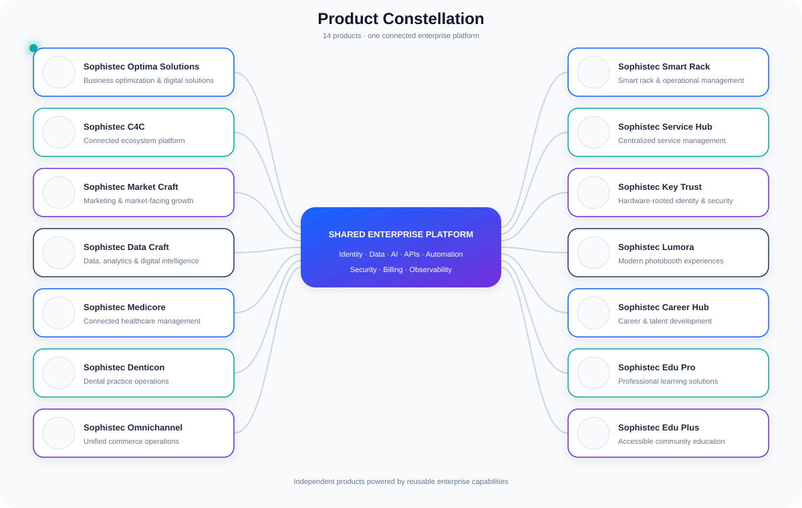</p>

### Cross-Border Collaboration
<p align="center">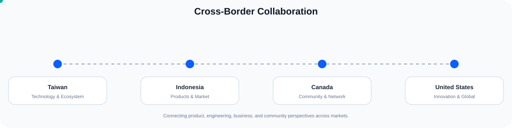</p>

### Request Lifecycle
<p align="center">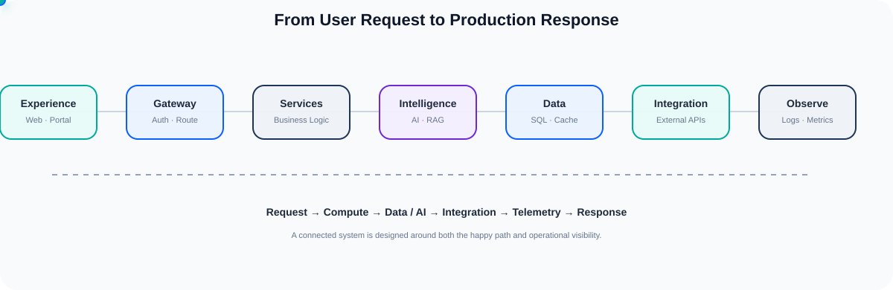</p>

### Agentic Execution
<p align="center">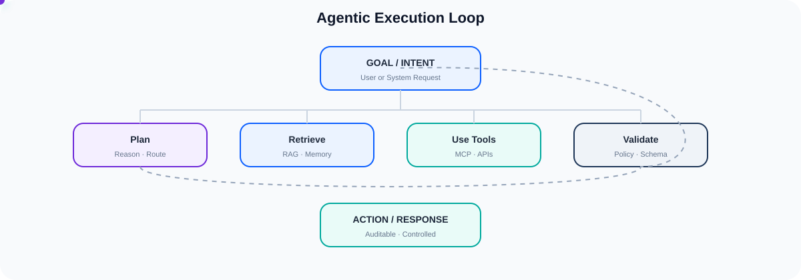</p>

### Data to Intelligence
<p align="center">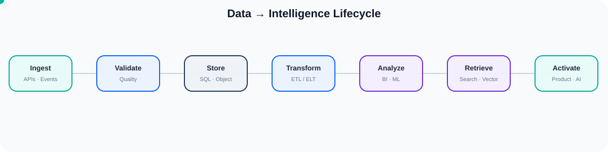</p>

### Engineering Principles
<p align="center">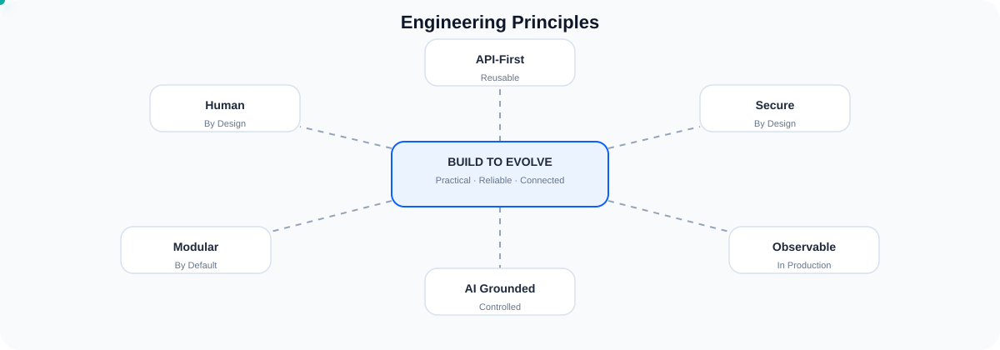</p>

### Capability System
<p align="center">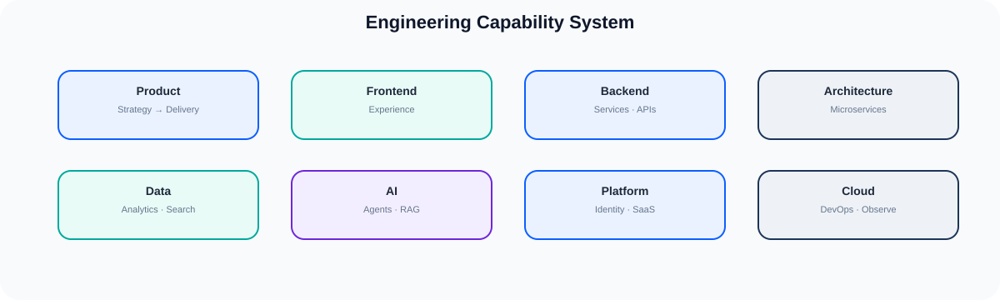</p>

## Premium Engineering Visuals

These diagrams summarize how Sophistec approaches product engineering as connected systems rather than isolated technologies.

<p align="center">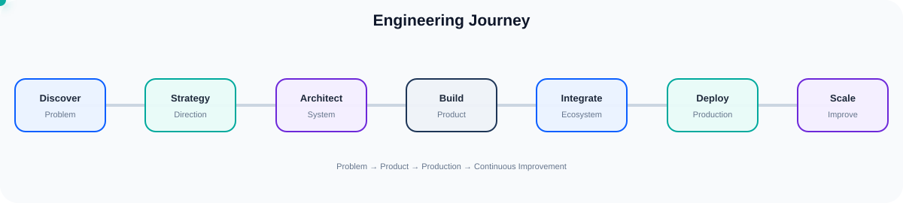</p>

### Connected Platform
<p align="center">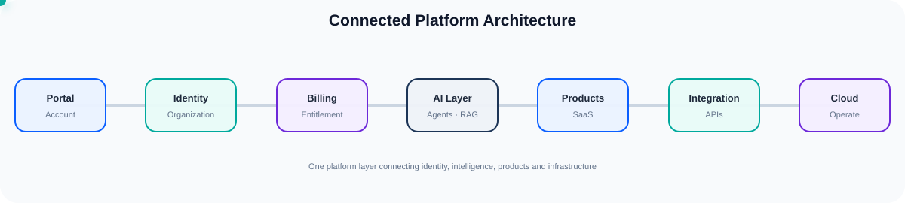</p>

### Microservices & Distributed Systems
<p align="center">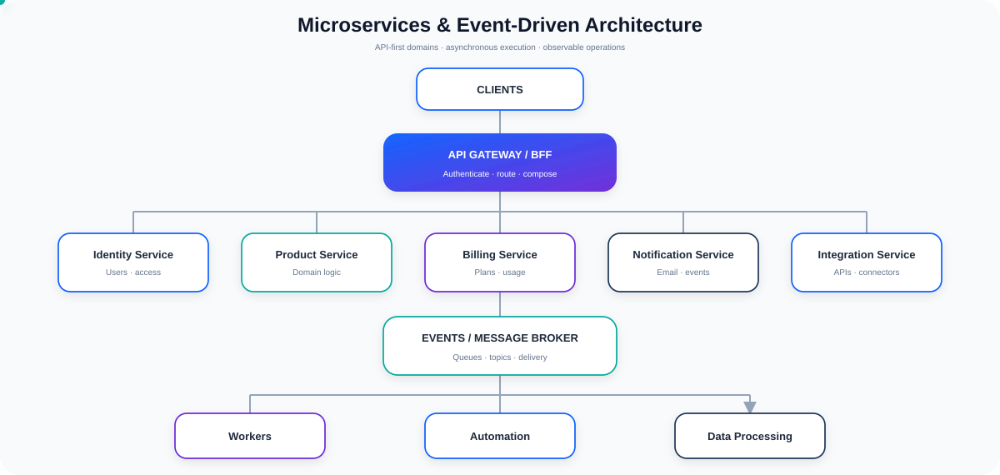</p>

### AI-Native Intelligence
<p align="center">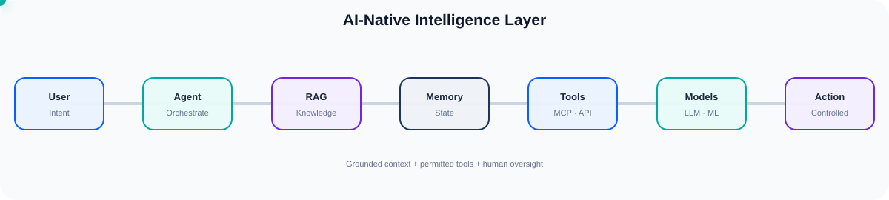</p>

### Enterprise RAG
<p align="center">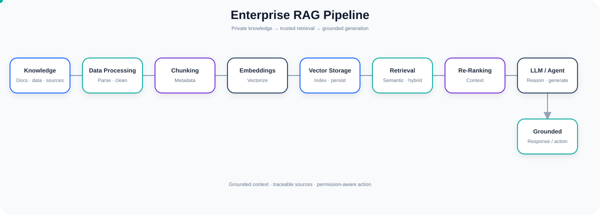</p>

### CI/CD & Production Delivery
<p align="center">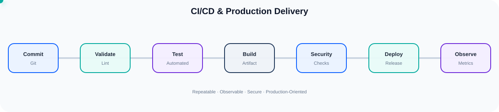</p>

### Enterprise Integration
<p align="center">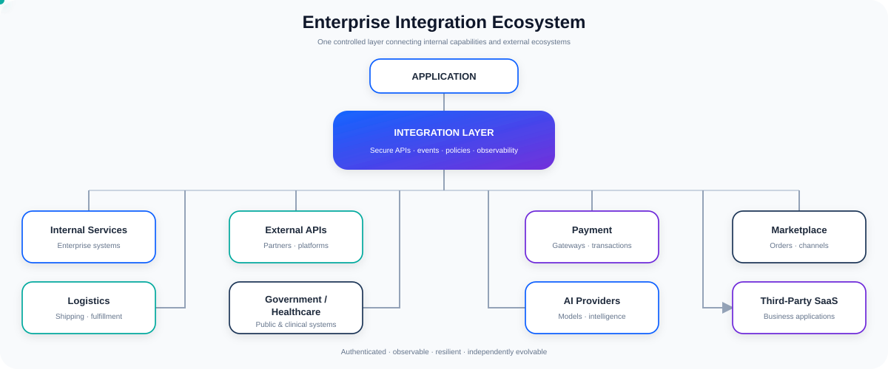</p>

### SaaS Identity & Entitlements
<p align="center">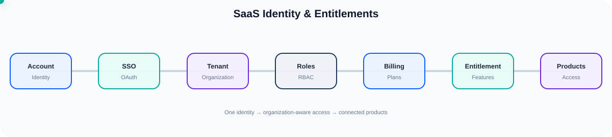</p>

### Observability & Reliability
<p align="center">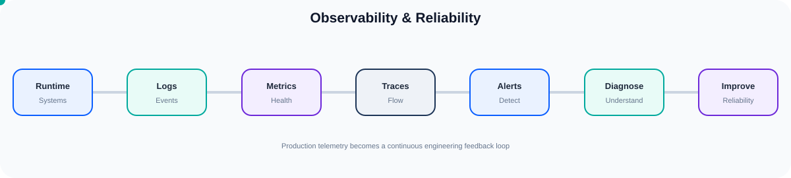</p>

### Security by Design
<p align="center">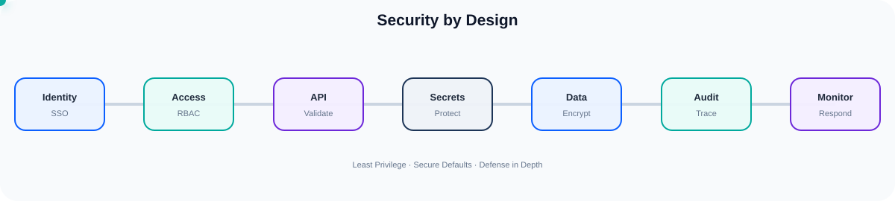</p>

## Technology & Engineering Capabilities

Sophistec combines product thinking, software engineering, artificial
intelligence, data, infrastructure, and system integration to build
practical digital products from end to end.

```{=html}
<p align="center">
```
``{=html}
```{=html}
</p>
```
### Frontend Development

```{=html}
<p>
```
``{=html}
``{=html}
``{=html}
``{=html}
``{=html}
``{=html}
``{=html}
```{=html}
</p>
```
**Extended frontend capabilities:** SPA · SSR · SSG · responsive
applications · component architecture · state management · design
systems · admin dashboards · SaaS portals · authentication flows · API
integration · real-time interfaces · accessibility · performance
optimization.

### Frontend Development

```{=html}
<p>
```
``{=html}
``{=html}
``{=html}
``{=html}
``{=html}
``{=html}
``{=html}
``{=html}
``{=html}
```{=html}
</p>
```
We build responsive web applications, SaaS interfaces, management
dashboards, admin panels, customer portals, and data-driven user
experiences with reusable component architecture and API-first
integration.

### Backend & API Engineering

```{=html}
<p>
```
``{=html}
``{=html}
``{=html}
``{=html}
``{=html}
``{=html}
``{=html}
``{=html}
``{=html}
```{=html}
</p>
```
**Extended backend capabilities:** Go services · REST · GraphQL · gRPC ·
WebSockets · OAuth 2.0 · JWT · RBAC/ABAC · queues · workers · scheduled
jobs · event processing · webhooks · idempotency · rate limiting ·
caching · API gateways · service-to-service communication.

### Backend & API Engineering

```{=html}
<p>
```
``{=html}
``{=html}
``{=html}
``{=html}
``{=html}
``{=html}
``{=html}
``{=html}
```{=html}
</p>
```
Our backend work includes REST APIs, authentication, authorization, JWT,
OAuth, RBAC, business logic, background jobs, queues, scheduled tasks,
webhooks, notifications, audit trails, API versioning, and third-party
integrations.

### AI, LLM & Intelligent Systems

```{=html}
<p>
```
``{=html}
``{=html}
``{=html}
``{=html}
``{=html}
``{=html}
``{=html}
``{=html}
```{=html}
</p>
```
We explore and build AI-powered systems around:

-   **Large Language Models (LLMs)** and generative AI applications
-   **AI Agents** that can reason across tools, APIs, databases, and
    workflows
-   **Multi-Agent Systems** and agent orchestration
-   **Retrieval-Augmented Generation (RAG)** for grounded,
    knowledge-aware applications
-   **Agentic RAG** for multi-step retrieval, reasoning, and tool
    execution
-   **Embeddings, Vector Search & Semantic Search**
-   **Function Calling & Tool Calling**
-   **Prompt Engineering & Context Engineering**
-   **Model Context Protocol (MCP)**
-   **Knowledge Base Systems & Document Intelligence**
-   **AI Workflow & Business Process Automation**
-   **Human-in-the-Loop AI Systems**

A typical intelligent application can connect models with private
knowledge and operational tools:

``` text
User / Application
        │
        ▼
     AI Agent
        │
        ├── Context & Memory
        ├── RAG / Knowledge Base
        ├── Vector Search
        ├── Databases
        ├── Internal APIs
        ├── External APIs
        └── Business Tools
                │
                ▼
        Response / Action
```

### RAG & Enterprise Knowledge Systems

Our RAG-oriented architecture can include:

``` text
Documents / Structured Data / Knowledge
                  │
                  ▼
          Data Processing
                  │
                  ▼
        Chunking & Metadata
                  │
                  ▼
             Embeddings
                  │
                  ▼
           Vector Storage
                  │
                  ▼
 Semantic / Hybrid Retrieval
                  │
                  ▼
      Re-Ranking & Context
                  │
                  ▼
             LLM / Agent
                  │
                  ▼
      Grounded Response / Action
```

Key areas include document processing, chunking strategies, metadata,
embeddings, vector databases, semantic retrieval, hybrid search,
re-ranking, context construction, grounded generation, citations, and
enterprise knowledge integration.

### Machine Learning & Data

```{=html}
<p>
```
``{=html}
``{=html}
``{=html}
``{=html}
``{=html}
```{=html}
</p>
```
Our data and machine-learning capabilities cover data preparation,
analysis, visualization, feature engineering, classification,
regression, clustering, predictive workflows, ML pipelines, model
evaluation, and computer-vision-oriented applications.

### Databases, Cache, Search & Data Infrastructure

```{=html}
<p>
```
``{=html}
``{=html}
``{=html}
```{=html}
</p>
```
**Extended data capabilities:** relational modeling · indexing ·
transactions · migrations · query optimization · caching · full-text
search · search indexes · vector storage · semantic retrieval ·
backup/recovery strategies · data integrity.

### Databases & Data Infrastructure

```{=html}
<p>
```
``{=html}
``{=html}
``{=html}
``{=html}
``{=html}
``{=html}
```{=html}
</p>
```
We work with relational data modeling, schema design, indexing, query
optimization, caching, transactions, data integrity, migrations, vector
storage, and semantic retrieval infrastructure.

### Microservices, Distributed Systems & Event-Driven Architecture

```{=html}
<p>
```
``{=html}
``{=html}
``{=html}
``{=html}
``{=html}
``{=html}
```{=html}
</p>
```
Sophistec designs architecture according to product scale and
operational requirements, including:

-   Monolithic and modular-monolith architecture
-   Microservices and service-oriented architecture
-   Distributed systems
-   API-first architecture
-   Event-driven architecture
-   Domain-oriented service boundaries
-   API Gateway / Backend-for-Frontend patterns
-   Service-to-service communication
-   Asynchronous processing
-   Horizontal scaling and load balancing
-   Fault isolation, retries, timeouts and resilience patterns
-   Eventual consistency where appropriate
-   Observability and distributed tracing

``` text
Clients
  │
  ▼
API Gateway / BFF
  │
  ├── Identity Service
  ├── Product Service
  ├── Billing Service
  ├── Notification Service
  └── Integration Service
          │
          ▼
   Events / Message Broker
          │
          ├── Workers
          ├── Automation
          └── Data Processing
```

### Messaging, Queues & Event Processing

```{=html}
<p>
```
``{=html}
``{=html}
``{=html}
```{=html}
</p>
```
Message queues · publish/subscribe · background workers · asynchronous
jobs · event consumers · retry/dead-letter strategies · notification
pipelines · scheduled processing · data synchronization.

### SaaS & Software Architecture

Our engineering approach covers architecture beyond individual
applications:

-   SaaS & multi-tenant platforms
-   Modular monoliths and service-oriented systems
-   Microservices where appropriate
-   API-first architecture
-   Event-driven workflows
-   Centralized identity and account systems
-   Organization and tenant management
-   SSO, OAuth, JWT & RBAC
-   Product entitlements and access control
-   Subscription, billing & usage architecture
-   Audit logging
-   Webhooks and integration layers
-   Scalable product and service architecture

``` text
Users
  │
  ▼
Identity & Authentication
  │
  ▼
Organization / Tenant
  │
  ├── Users & Teams
  ├── Roles & Permissions
  ├── Products & Entitlements
  ├── Subscription & Billing
  └── Usage & Audit
        │
        ▼
 Connected SaaS Products
```

### Integration Engineering

Sophistec builds software that connects with wider digital ecosystems.

Integration areas can include:

-   REST APIs
-   Webhooks
-   Authentication providers
-   Payment gateways
-   Marketplace platforms
-   Logistics providers
-   Communication services
-   Healthcare systems
-   Government systems
-   AI providers
-   External SaaS platforms
-   Internal enterprise systems

``` text
Application
    │
    ▼
Integration Layer
    │
    ├── Internal Services
    ├── External APIs
    ├── Payment
    ├── Marketplace
    ├── Logistics
    ├── Government / Healthcare
    ├── AI Providers
    └── Third-Party SaaS
```

### DevOps, Cloud, Containers & Infrastructure

```{=html}
<p>
```
``{=html}
``{=html}
``{=html}
```{=html}
</p>
```
**Extended infrastructure capabilities:** containerization ·
orchestration · reverse proxy · load balancing · deployment automation ·
environment management · horizontal scaling · backups · health checks ·
production monitoring.

### DevOps, Cloud & Infrastructure

```{=html}
<p>
```
``{=html}
``{=html}
``{=html}
``{=html}
``{=html}
``{=html}
```{=html}
</p>
```
Infrastructure capabilities include Linux environments, Docker, Nginx,
reverse proxies, SSL/TLS, DNS, Git-based workflows, CI/CD, process
management, deployment, logging, monitoring, and production
troubleshooting.

------------------------------------------------------------------------

### Additional Modern Engineering Capabilities

To complement the core stack above, Sophistec's engineering capability map also covers several important production-system areas:

<p>


</p>

- **API Contracts & Developer Experience:** OpenAPI / Swagger, API schemas, versioning, SDK-oriented interfaces, API documentation, contract validation, and Postman-based API workflows.
- **Infrastructure as Code:** declarative infrastructure and repeatable environment provisioning patterns, including Terraform-oriented workflows where appropriate.
- **Observability Stack:** metrics, dashboards, distributed telemetry, traces, logs, alerting, and OpenTelemetry-oriented instrumentation.
- **Object & File Storage:** object-storage patterns for documents, media, exports, backups, and application assets.
- **Caching & Performance:** distributed caching, query optimization, connection management, background processing, CDN-aware delivery, and performance profiling.
- **Resilience Engineering:** retries, timeouts, circuit breakers, idempotency, graceful degradation, dead-letter handling, and failure isolation.
- **API & Application Security:** OWASP-aware secure development, CORS/CSP/security headers, validation, secrets management, dependency hygiene, auditability, and secure-by-default API patterns.
- **Testing Strategy:** unit, integration, contract, API, end-to-end, load/performance, and regression testing integrated into delivery pipelines.
- **Data Governance Foundations:** data lifecycle, retention, access boundaries, audit trails, backups, recovery, and privacy-aware system design.
- **Developer Platform Practices:** reusable shared services, common components, internal APIs, templates, automation, documentation, and standardized delivery workflows.

### Observability & Reliability Engineering

Logging · metrics · monitoring · health checks · alerting · tracing ·
distributed tracing · error tracking · uptime monitoring · performance
profiling · incident troubleshooting · graceful failure · retry
strategies · resilience patterns.

### Security Engineering

Authentication · authorization · OAuth 2.0 · JWT · RBAC · ABAC · API
keys · secrets management · TLS · encryption in transit · encryption at
rest · audit logging · rate limiting · input validation · least
privilege · secure API design · session security · security headers.

### Testing & Quality Engineering

Unit testing · integration testing · API testing · end-to-end testing ·
regression testing · automated CI validation · linting · static analysis
· code review · staging environments · performance testing ·
documentation · maintainable architecture.

### Platform Engineering

Centralized identity · organizations · tenants · teams · roles ·
permissions · SSO · product entitlements · subscription plans · billing
· usage tracking · quotas · API keys · provisioning · audit trails ·
multi-product account access.

### Additional Engineering Coverage

  -----------------------------------------------------------------------
  Area                                Technologies / Capabilities
  ----------------------------------- -----------------------------------
  **Frontend**                        React, Next.js, Vue.js, Nuxt,
                                      JavaScript, TypeScript, Vite,
                                      Tailwind CSS, Bootstrap, SSR, SSG,
                                      SPA

  **Backend**                         Go (Golang), PHP, Laravel, Python,
                                      FastAPI, Flask, Node.js, REST,
                                      GraphQL, gRPC, WebSockets

  **Architecture**                    Modular Monolith, Microservices,
                                      SOA, Distributed Systems,
                                      Event-Driven Architecture,
                                      API-First, Multi-Tenant SaaS

  **Messaging**                       RabbitMQ, Kafka concepts, Redis,
                                      queues, workers, pub/sub,
                                      asynchronous processing

  **AI Engineering**                  LLMs, Generative AI, AI Agents,
                                      Multi-Agent Systems, RAG, Agentic
                                      RAG, MCP, Tool Calling, Function
                                      Calling

  **AI Retrieval**                    Embeddings, Vector Search, Semantic
                                      Search, Hybrid Search, Re-Ranking,
                                      Knowledge Bases

  **ML & Data**                       scikit-learn, XGBoost, Pandas,
                                      NumPy, Jupyter, ETL/ELT, analytics,
                                      computer vision

  **Data**                            MySQL, PostgreSQL, SQLite, Redis,
                                      pgvector, vector databases,
                                      Elasticsearch/search

  **Identity**                        SSO, OAuth 2.0, JWT, RBAC, ABAC,
                                      API Keys, centralized identity

  **SaaS Platform**                   Organizations, tenants,
                                      subscriptions, billing, usage,
                                      quotas, entitlements, provisioning

  **DevOps**                          Docker, Kubernetes concepts, Linux,
                                      Nginx, Git, GitHub Actions, CI/CD,
                                      deployment automation

  **Reliability**                     Logging, monitoring, metrics,
                                      tracing, health checks, alerting,
                                      retries, resilience

  **Security**                        TLS, encryption, secrets, audit
                                      logs, rate limiting, validation,
                                      least privilege

  **Integration**                     REST, GraphQL, gRPC, Webhooks,
                                      Payments, Marketplace, Logistics,
                                      Healthcare, Government, Third-Party
                                      SaaS

  **Quality**                         Unit, Integration, API, E2E,
                                      Regression, CI validation, Code
                                      Review, Documentation
  -----------------------------------------------------------------------

## Engineering Focus Areas

  -----------------------------------------------------------------------
  Focus                               What We Build
  ----------------------------------- -----------------------------------
  **Full-Stack Product Engineering**  End-to-end digital products
                                      spanning frontend, backend, APIs,
                                      databases, and infrastructure.

  **AI Agents & Intelligent           AI systems that interact with
  Automation**                        tools, APIs, databases, knowledge,
                                      and operational workflows.

  **RAG & Enterprise Knowledge**      Grounded AI applications using
                                      private documents, structured data,
                                      embeddings, and semantic retrieval.

  **Backend & API Architecture**      Robust application services,
                                      authentication, business logic,
                                      integrations, queues, and APIs.

  **SaaS & Multi-Tenant Platforms**   Organization-aware platforms with
                                      identity, RBAC, subscriptions,
                                      billing, usage, and product access.

  **Machine Learning & Data**         Practical data pipelines,
                                      analytics, predictive models, and
                                      intelligent applications.

  **Enterprise Integration**          Connections between internal
                                      systems, third-party platforms,
                                      government services, healthcare,
                                      commerce, and AI providers.

  **Cloud & Infrastructure**          Production deployment,
                                      containerization, web
                                      infrastructure, CI/CD, monitoring,
                                      and operational reliability.
  -----------------------------------------------------------------------

## From Product Idea to Production

Sophistec's technology work is designed around the complete lifecycle of
a digital product:

``` text
Problem
   ↓
Product Strategy
   ↓
System Architecture
   ↓
UI / UX
   ↓
Frontend + Backend
   ↓
Data + Integrations
   ↓
AI / Automation
   ↓
Testing + Security
   ↓
Deployment
   ↓
Monitoring
   ↓
Continuous Improvement
```

This allows us to approach technology not as isolated code, but as a
connected product, operational, and business system.

## Our Technology Philosophy

> **Human ingenuity. AI acceleration. Practical impact.**

We believe the strongest technology comes from the synergy between
**human creativity, critical thinking, domain understanding, and
artificial intelligence**.

AI can accelerate development, automate repetitive work, improve access
to knowledge, and unlock entirely new product experiences. But
meaningful technology still depends on thoughtful architecture, product
judgment, security, reliability, and a clear understanding of the people
and organizations it serves.

``` text
Human Creativity + Engineering Judgment + AI
                     │
                     ▼
             Better Technology
                     │
                     ▼
              Practical Value
                     │
                     ▼
              Real-World Impact
```

Our goal is not simply to add AI to software.

Our goal is to build technology that is **useful, connected, scalable,
responsible, and designed to evolve**.

------------------------------------------------------------------------

## The Sophistec Engineering Loop

```{=html}
<p align="center">
```
``{=html}
```{=html}
</p>
```
::: {align="center"}
`DISCOVER` → `STRATEGY` → `ARCHITECT` → `BUILD` → `INTEGRATE` →
`AUTOMATE` → `DEPLOY` → `SCALE`

`<sub>`{=html}Product thinking and engineering operate as one continuous
improvement loop.`</sub>`{=html}
:::

------------------------------------------------------------------------

## From Interface to Intelligence

Sophistec is designed to work across the complete technology stack
rather than treating frontend, backend, infrastructure, data, and AI as
isolated disciplines.

``` text
┌─────────────────────────────────────────────────────────────────┐
│                     EXPERIENCE LAYER                            │
│        Web · Mobile · Portals · Dashboards · Admin              │
└──────────────────────────────┬──────────────────────────────────┘
                               │
┌──────────────────────────────▼──────────────────────────────────┐
│                     APPLICATION LAYER                           │
│      APIs · Services · Business Logic · Real-Time Systems       │
└──────────────────────────────┬──────────────────────────────────┘
                               │
┌──────────────────────────────▼──────────────────────────────────┐
│                    INTELLIGENCE LAYER                           │
│       AI Agents · RAG · LLMs · ML · Automation · Search        │
└──────────────────────────────┬──────────────────────────────────┘
                               │
┌──────────────────────────────▼──────────────────────────────────┐
│                        DATA LAYER                               │
│   SQL · Cache · Search · Vector Data · Events · Knowledge       │
└──────────────────────────────┬──────────────────────────────────┘
                               │
┌──────────────────────────────▼──────────────────────────────────┐
│                    PLATFORM & CLOUD LAYER                       │
│ Containers · CI/CD · Linux · Networking · Observability         │
└──────────────────────────────┬──────────────────────────────────┘
                               │
┌──────────────────────────────▼──────────────────────────────────┐
│                    INTEGRATION ECOSYSTEM                        │
│ Payments · Government · Healthcare · Logistics · SaaS · APIs    │
└─────────────────────────────────────────────────────────────────┘
```

------------------------------------------------------------------------

## Architecture Principles

  -----------------------------------------------------------------------
  Principle                           How We Apply It
  ----------------------------------- -----------------------------------
  **API-First**                       Capabilities are designed to be
                                      reusable across products,
                                      interfaces, and integrations.

  **Modular by Default**              Clear domain boundaries make
                                      systems easier to evolve and scale.

  **Microservices When They Earn      Independent services are introduced
  Their Complexity**                  when scale, ownership, resilience,
                                      or deployment boundaries justify
                                      them.

  **Event-Driven Where It Helps**     Queues and events decouple
                                      long-running, asynchronous, and
                                      cross-system workflows.

  **Secure by Design**                Identity, authorization,
                                      auditability, validation, and least
                                      privilege are considered at
                                      architecture level.

  **Observable in Production**        Logs, metrics, health checks,
                                      traces, and operational visibility
                                      are part of the system---not an
                                      afterthought.

  **AI with Grounding & Control**     Retrieval, tools, structured
                                      outputs, permissions, and human
                                      oversight make AI useful in real
                                      workflows.

  **Built to Evolve**                 Architecture should support
                                      iteration without requiring
                                      unnecessary rewrites.
  -----------------------------------------------------------------------

------------------------------------------------------------------------

## AI-Native Product Architecture

```{=html}
<p align="center">
```
``{=html}
```{=html}
</p>
```
``` text
                         ┌──────────────┐
                         │ User / App   │
                         └──────┬───────┘
                                │
                         ┌──────▼───────┐
                         │ AI Gateway   │
                         └──────┬───────┘
                                │
                   ┌────────────▼────────────┐
                   │ Agent / Orchestrator    │
                   └────────────┬────────────┘
                                │
             ┌──────────────────┼──────────────────┐
             ▼                  ▼                  ▼
       ┌──────────┐       ┌──────────┐       ┌──────────┐
       │   RAG    │       │  Memory  │       │  Tools   │
       └────┬─────┘       └────┬─────┘       └────┬─────┘
            │                  │                  │
      ┌─────▼─────┐            │        ┌────────▼────────┐
      │ Knowledge │            │        │ APIs / Systems  │
      │  & Vector │            │        │ / Workflows     │
      └───────────┘            │        └─────────────────┘
                               │
                   ┌───────────▼───────────┐
                   │ Policy / Permissions │
                   └───────────┬───────────┘
                               │
                         ┌─────▼─────┐
                         │  Action   │
                         └───────────┘
```

The objective is to move beyond isolated chat interfaces toward AI
systems that can retrieve trusted context, use permitted tools, interact
with software, and support real operational workflows.

------------------------------------------------------------------------

## Delivery Lifecycle

::: {align="center"}
  ---------------------------------------------------------------------------------------------------------------
        01             02             03            04            05            06           07           08
  -------------- -------------- --------------- ----------- -------------- ------------ ------------- -----------
        🔎             🧭             🏗️            💻            🧪            🚀           📡           📈

   **Discover**   **Strategy**   **Architect**   **Build**   **Validate**   **Deploy**   **Observe**   **Scale**
  ---------------------------------------------------------------------------------------------------------------
:::

**Discover** the real problem → **define** product and technical
direction → **architect** the system → **build** in iterations →
**validate** quality and security → **deploy** reliably → **observe**
production behavior → **improve and scale**.

------------------------------------------------------------------------

## Built for Real-World Systems

Our engineering capabilities are especially relevant to platforms where
multiple domains need to work together:

```{=html}
<p align="center">
```
``{=html}
``{=html}
``{=html}
``{=html}
``{=html}
```{=html}
</p>
```
Healthcare workflows, omnichannel commerce, enterprise operations,
customer support, centralized identity, billing, integrations,
analytics, and AI automation can be designed as connected parts of a
wider platform ecosystem.

------------------------------------------------------------------------

## Engineering Maturity

A premium product is not defined only by its framework. We consider the
operational characteristics that determine whether software is ready to
become infrastructure for a business.

  Build          Operate               Protect             Evolve
  -------------- --------------------- ------------------- ------------------------
  Architecture   Monitoring            Identity & Access   Modular Design
  APIs           Logging               Encryption          Versioning
  Data Models    Metrics               Auditability        Automated Testing
  Integrations   Health Checks         Validation          CI/CD
  Automation     Incident Visibility   Least Privilege     Documentation
  AI Workflows   Performance           Secure Secrets      Continuous Improvement

------------------------------------------------------------------------

## How We Work

> We make ambitious ideas usable.

We combine strategic thinking with hands-on execution. Every project
starts from a real problem, moves through clear product thinking and
design, and ends with a solution that can create practical value.

-   **Impact first**: build for meaningful, measurable outcomes.
-   **Human by design**: technology should feel useful and accessible.
-   **Ownership in the details**: care deeply about quality, clarity,
    and follow-through.
-   **Built to evolve**: launch quickly, learn continuously, and improve
    deliberately.
-   **Stronger together**: create with clients, partners, developers,
    creators, and communities.

## Engineering Governance & Operational Maturity

As systems become business-critical, engineering quality depends on more than implementation. Sophistec also considers how systems are changed, released, supported, documented, and continuously improved.

### API Lifecycle & Developer Experience
<p align="center">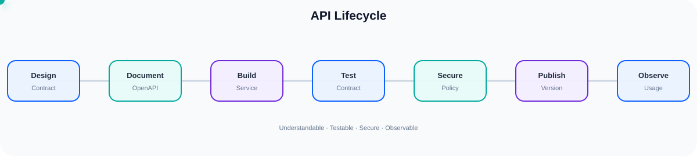</p>

Contract-first design · OpenAPI / Swagger · versioning · consistent authentication and errors · contract testing · API observability · developer documentation.

### Product Learning Loop
<p align="center">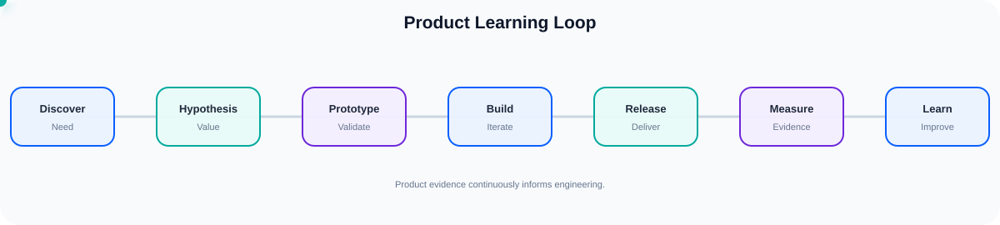</p>

Engineering delivery connects back to users and outcomes: understand the problem, validate assumptions, release iteratively, observe real usage, and use evidence to guide improvement.

### Incident Response & Reliability
<p align="center">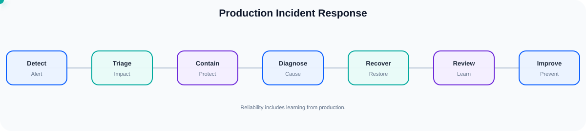</p>

Production maturity includes detection, triage, containment, diagnosis, recovery, review, and preventive improvement.

### Data Governance & Lifecycle
<p align="center">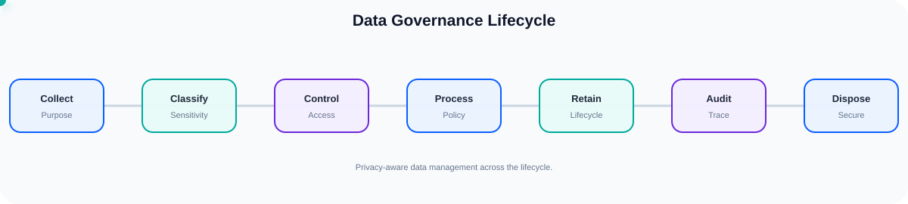</p>

Architecture considers data purpose, classification, access boundaries, retention, auditability, backup/recovery, privacy-aware processing, and secure disposal.

## Documentation as Engineering

| Artifact | Purpose |
| --- | --- |
| **Architecture Decision Records (ADR)** | Preserve important technical decisions and their reasoning. |
| **API Documentation** | Define contracts, authentication, payloads, errors, and examples. |
| **System Architecture** | Explain services, boundaries, data flows, and dependencies. |
| **Runbooks** | Repeatable procedures for deployment, recovery, and incidents. |
| **Data Dictionary** | Clarify important entities, fields, ownership, and meaning. |
| **Security Notes** | Document access models, secrets, audit behavior, and assumptions. |
| **Changelog / Release Notes** | Make product and platform changes visible over time. |
| **Developer Onboarding** | Help engineers understand and contribute safely. |

## Repository Standards

```text
repository/
├── README.md
├── docs/
│   ├── architecture/
│   ├── api/
│   ├── adr/
│   └── runbooks/
├── src/
├── tests/
├── scripts/
├── .github/
│   ├── workflows/
│   ├── ISSUE_TEMPLATE/
│   └── PULL_REQUEST_TEMPLATE.md
├── CHANGELOG.md
├── CONTRIBUTING.md
├── SECURITY.md
└── LICENSE
```

`README` · `Architecture` · `API Docs` · `Tests` · `CI/CD` · `Security Policy` · `Contributing Guide` · `Changelog`

## Open Source & Collaboration

Where appropriate, Sophistec can use GitHub as a public engineering surface for reusable libraries and SDKs, API examples, developer tooling, selected reference architectures, technical documentation, community contributions, and engineering research.

> **Build openly where it creates value. Protect what must remain private. Document both deliberately.**

## Engineering Trust

Technical credibility should come from evidence rather than buzzwords: working products, clear architecture, maintained repositories, meaningful releases, automated testing, documented APIs, security practices, observable systems, reproducible deployment, and thoughtful engineering decisions.

**The technology stack explains what we can use. The products and engineering practices demonstrate how we build.**

## Enterprise Engineering & Platform Direction

The next stage of Sophistec engineering is to evolve from a collection of products and technologies into a **coherent platform, architecture framework, developer ecosystem, and operational model**. The sections below describe that direction. Roadmap capabilities such as SDKs and CLI tooling should only be presented as generally available once implemented and supported.

### Sophistec Engineering Framework
<p align="center">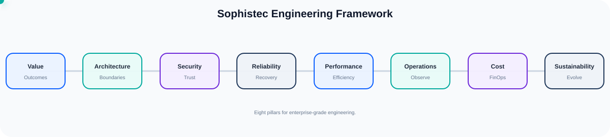</p>

Our framework uses eight pillars: **Product Value, Architecture, Security & Trust, Reliability, Performance, Operational Excellence, Cost Efficiency, and Sustainability & Evolution**.

### Sophistec Enterprise Platform
<p align="center"></p>

```text
Sophistec Platform
├── Identity & Organization
├── Billing & Entitlements
├── API & Integration
├── Data & Intelligence
├── Automation & Notifications
├── Observability & Security
└── Developer Platform
```

Shared capabilities support product domains while allowing products to evolve independently.

### Extension & Connector Framework
<p align="center">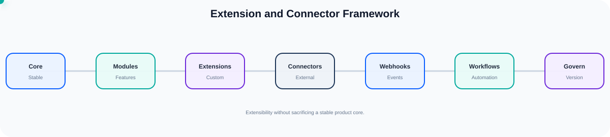</p>

A modular extension model can separate **product core, modules, extensions, connectors, webhooks, and custom workflows**, making enterprise customization more controlled and maintainable.

### Developer Platform
<p align="center">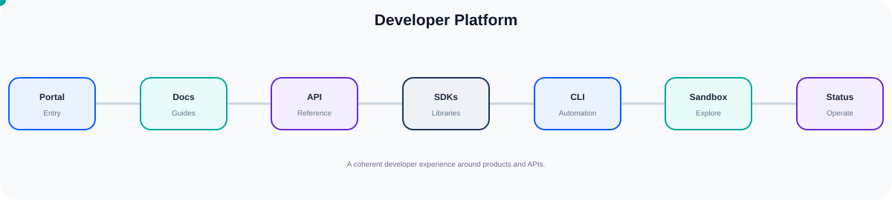</p>

The developer-platform direction includes **documentation, API reference, SDKs, CLI tooling, sandbox environments, examples, starter kits, changelogs, status information, and integration guides**.

### Developer Tooling Roadmap
<p align="center">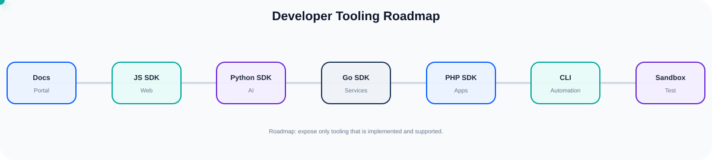</p>

Potential supported tooling includes JavaScript, Python, Go, and PHP SDKs plus a Sophistec CLI. These are **roadmap concepts**, not claims of current general availability unless separately published.

## Reliability, Continuity & SRE
<p align="center">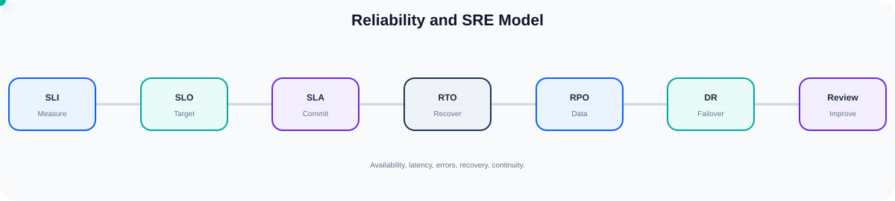</p>

Enterprise operations consider **SLIs, SLOs, SLAs, availability, latency, error rates, RTO, RPO, disaster recovery, backup verification, failover, incident response, and business continuity**.

## Cost & Capacity Engineering
<p align="center">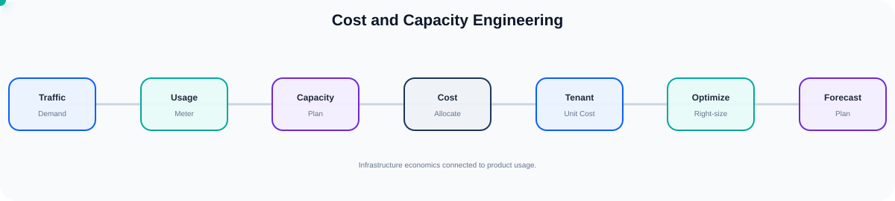</p>

FinOps-oriented engineering connects **traffic, usage metering, capacity planning, cost allocation, cost per tenant/product, right-sizing, forecasting, and optimization**.

## Sustainable Engineering
<p align="center">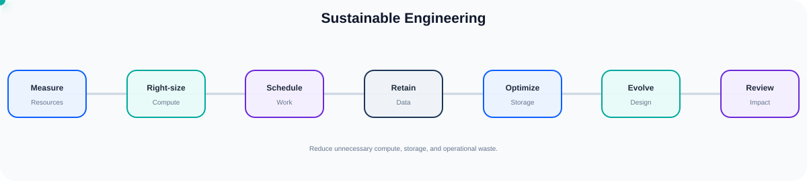</p>

Engineering sustainability includes resource efficiency, right-sizing, workload scheduling, sensible data retention, efficient storage, reduced unnecessary compute, and architecture longevity.

## Business Process Architecture
<p align="center">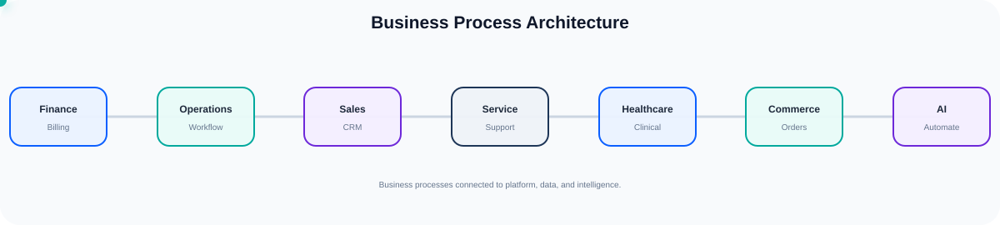</p>

Sophistec connects technology to business processes across **finance, operations, sales, customer service, healthcare, commerce, data, and intelligent automation**.

## Industry Solution Map
<p align="center">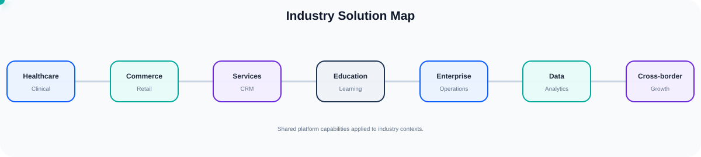</p>

Current and adjacent solution contexts include **healthcare, commerce & retail, professional services, education, enterprise operations, data & analytics, and cross-border digital business**.

## Sophistec Architecture Center
<p align="center">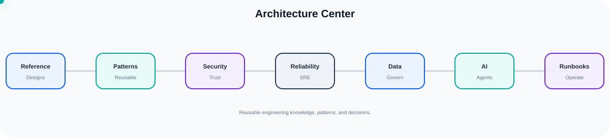</p>

The Architecture Center is a knowledge model for organizing reusable engineering guidance:

```text
architecture/
├── reference-architectures/
├── patterns/
│   ├── multi-tenant-saas/
│   ├── microservices/
│   ├── event-driven/
│   ├── rag/
│   └── ai-agents/
├── security/
├── reliability/
├── data/
├── integration/
├── ai/
├── adr/
└── runbooks/
```

## Architecture Review Framework
<p align="center">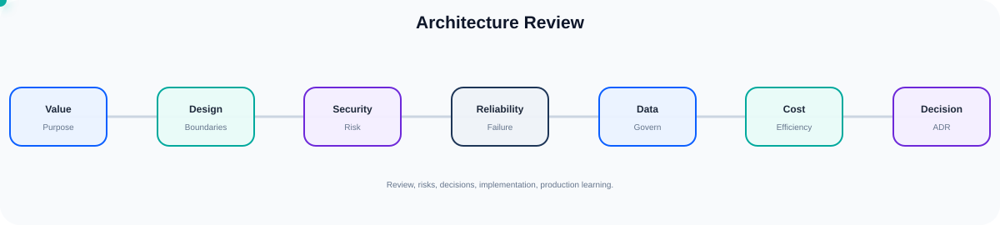</p>

Major systems can be reviewed against **product value, architecture, scalability, security, reliability, performance, observability, data, integration, AI controls, cost, maintainability, disaster recovery, and documentation**. Important decisions should be captured through Architecture Decision Records (ADRs).

## Enterprise Architecture Checklist

| Domain | Review Questions |
| --- | --- |
| **Product Value** | What measurable user or business outcome does the system create? |
| **Architecture** | Are boundaries, dependencies, interfaces, and ownership clear? |
| **Security** | Are identity, permissions, secrets, validation, encryption, and auditability designed in? |
| **Reliability** | What fails, how is it detected, and how is service restored? |
| **Performance** | What are the latency, throughput, capacity, and scaling expectations? |
| **Data** | Who owns the data, how is it protected, retained, recovered, and governed? |
| **Integration** | Are APIs, events, contracts, retries, and failure modes explicit? |
| **AI** | Is context grounded, tool access controlled, output validated, and human oversight appropriate? |
| **Operations** | Can the system be deployed, observed, diagnosed, supported, and rolled back? |
| **Cost** | Can usage and infrastructure cost be understood and optimized? |
| **Continuity** | Are backups, RTO/RPO, recovery procedures, and failover expectations defined? |
| **Documentation** | Can another engineer safely understand, operate, and evolve the system? |


## Enterprise Trust & Assurance

Enterprise technology requires more than feature breadth. Sophistec's trust model brings together security, privacy, reliability, governance, compliance evidence, and transparency.

<p align="center"></p>

### Trust Center Direction

<p align="center">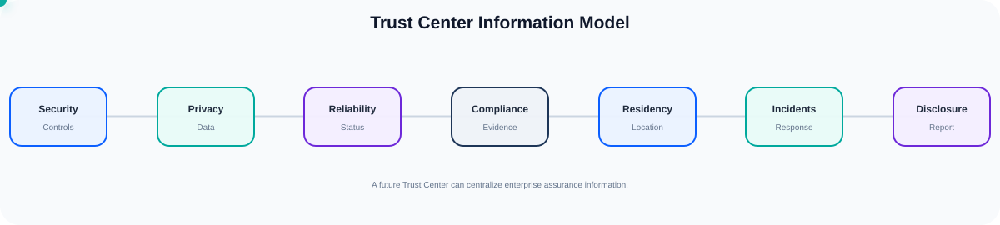</p>

A future Sophistec Trust Center can centralize information such as:

- security practices and vulnerability disclosure,
- privacy and data-processing information,
- data residency and subprocessors,
- reliability, service health, and incident communication,
- business continuity and disaster recovery,
- responsible AI principles,
- compliance evidence and certifications **only where actually applicable**,
- security advisories and operational transparency.

> Sophistec should distinguish between **compliance-aware architecture**, **compliance readiness**, and an independently verified **certification**. Certifications should never be claimed unless they have actually been obtained.

## Responsible AI Framework

<p align="center"></p>

Sophistec's AI direction should be governed by:

- **Human oversight** for consequential or ambiguous actions.
- **Grounded outputs** using trusted context where factual accuracy matters.
- **Permission boundaries** around tools, APIs, data, and actions.
- **Data minimization** and purpose-aware access.
- **Authentication & authorization** before privileged AI operations.
- **Structured output & validation** for machine-executed workflows.
- **Auditability** of important agent actions and system decisions.
- **Privacy & security** across prompts, retrieval, memory, tools, and logs.
- **Failure handling** for unavailable tools, uncertain context, and unsafe actions.
- **Responsible automation** so AI accelerates people without silently bypassing controls.

## Product Maturity Model

<p align="center">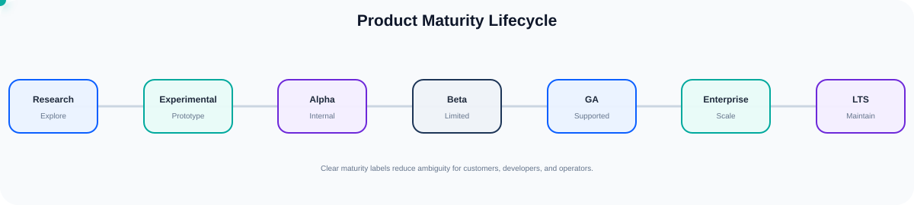</p>

| Stage | Meaning |
| --- | --- |
| **Research** | Exploration, validation, and technical investigation. |
| **Experimental** | Prototype; behavior and interfaces may change significantly. |
| **Alpha** | Early implementation for internal or tightly controlled use. |
| **Beta** | Limited production use with active feedback and known constraints. |
| **General Availability (GA)** | Supported production release with defined operational expectations. |
| **Enterprise** | Mature deployment, governance, integration, support, and reliability expectations. |
| **LTS** | Long-term support where a product or release warrants an extended maintenance lifecycle. |

Product repositories should clearly communicate maturity rather than making every project appear equally production-ready.

## API Versioning & Deprecation

<p align="center">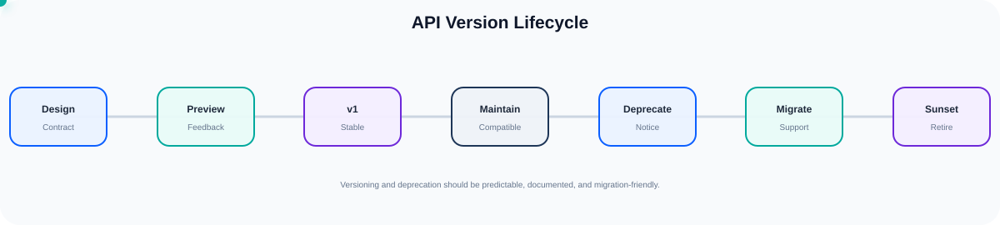</p>

API evolution should include stable contracts, documented versions, backward-compatibility expectations, migration guidance, deprecation notices, and a defined sunset process.

Recommended principles:

- avoid silent breaking changes,
- version public contracts deliberately,
- publish changelogs,
- communicate deprecation windows,
- provide migration documentation,
- maintain compatibility where reasonable,
- monitor usage before retiring an API.

## Deployment Models

<p align="center">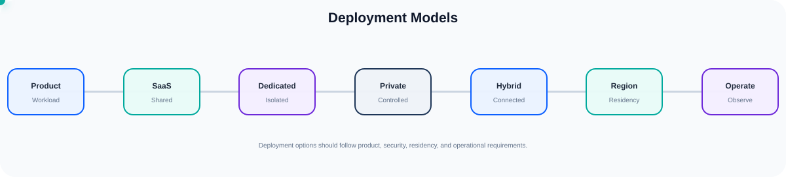</p>

Depending on the product and customer requirements, architecture may support different deployment patterns:

- **Multi-tenant SaaS**
- **Dedicated / isolated environments**
- **Private deployment**
- **Hybrid integration**
- **Region-aware deployment**
- **Customer-specific integration boundaries**

Availability of a deployment model should be stated per product rather than assumed globally.

## Release, Maintenance & Support Lifecycle

<p align="center">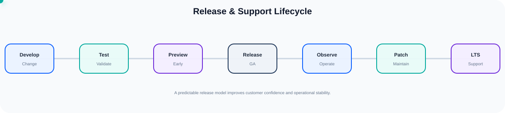</p>

A mature release process connects development with testing, preview channels, general availability, production observation, maintenance, patching, and—where appropriate—long-term support.

## Integration Catalog

<p align="center">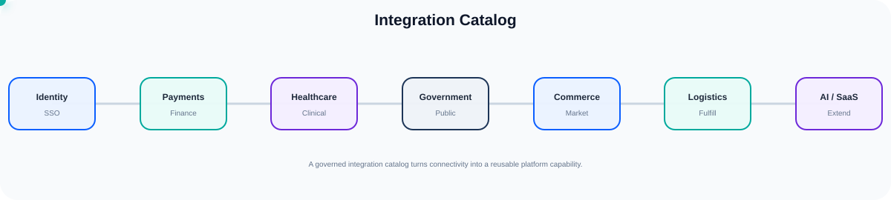</p>

Sophistec's integration ecosystem can be organized as a reusable catalog rather than a collection of one-off connections:

| Domain | Examples of Integration Capability |
| --- | --- |
| **Identity** | SSO, OAuth, external identity providers |
| **Payments** | Payment gateways and transaction services |
| **Healthcare** | Clinical, insurance, laboratory, and healthcare APIs |
| **Government** | Public-sector and regulatory system integrations |
| **Commerce** | Marketplace, order, inventory, and sales-channel APIs |
| **Logistics** | Shipping, fulfillment, and delivery services |
| **AI & SaaS** | Model providers, communication platforms, and external SaaS |

Each production connector should ultimately have ownership, versioning, authentication, observability, error handling, retry behavior, documentation, and support expectations.

## Why Sophistec Engineering

We connect **strategy, product thinking, engineering, data, AI, infrastructure, and integration** so digital products are designed as complete operating systems rather than isolated applications.

### What We Optimize For

- **Clarity** — architecture and ownership should be understandable.
- **Interoperability** — products should connect through well-defined interfaces.
- **Reliability** — production behavior matters as much as feature delivery.
- **Security** — identity, access, validation, and auditability belong in the design.
- **Automation** — repetitive operational work should be reduced where practical.
- **Intelligence** — AI should have trusted context, controlled tools, and measurable purpose.
- **Evolution** — systems should support change without unnecessary rewrites.

## Build With Us

Sophistec is interested in collaborations around **SaaS, enterprise software, healthcare technology, omnichannel systems, AI agents, RAG, automation, data platforms, integrations, and cross-border digital products**.

For product, engineering, partnership, or ecosystem conversations, use the contact channels below.

## Connect with Us

::: {align="center"}
`<a href="https://sophistec.global/" target="_blank" rel="noopener noreferrer">`{=html}
``{=html}
`</a>`{=html} `<a href="mailto:management@sophistec.global">`{=html}
``{=html}
`</a>`{=html}
`<a href="https://api.whatsapp.com/send/?phone=886971688450&text&type=phone_number&app_absent=0" target="_blank" rel="noopener noreferrer">`{=html}
``{=html}
`</a>`{=html}
`<a href="https://www.linkedin.com/company/sophistec-global" target="_blank" rel="noopener noreferrer">`{=html}
``{=html}
`</a>`{=html}
`<a href="https://www.facebook.com/sophistec.global" target="_blank" rel="noopener noreferrer">`{=html}
``{=html}
`</a>`{=html}
`<a href="https://www.instagram.com/sophistec.global" target="_blank" rel="noopener noreferrer">`{=html}
``{=html}
`</a>`{=html}
`<a href="https://www.youtube.com/@SophistecGlobal" target="_blank" rel="noopener noreferrer">`{=html}
``{=html}
`</a>`{=html}
`<a href="https://www.tiktok.com/@sophistec.global" target="_blank" rel="noopener noreferrer">`{=html}
``{=html}
`</a>`{=html}
`<a href="https://x.com/SophistecGlobal" target="_blank" rel="noopener noreferrer">`{=html}
``{=html}
`</a>`{=html}

`<br>`{=html}`<br>`{=html}
:::

------------------------------------------------------------------------

::: {align="center"}
### "Building the future, one step at a time." 🚀

`<br>`{=html}


:::
